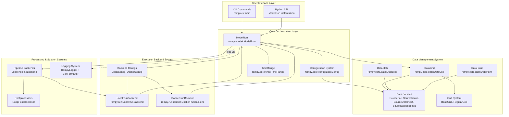
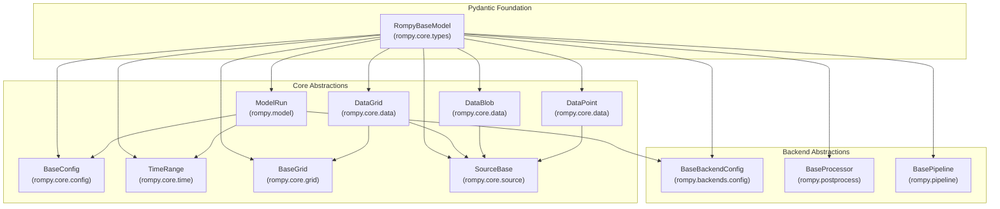
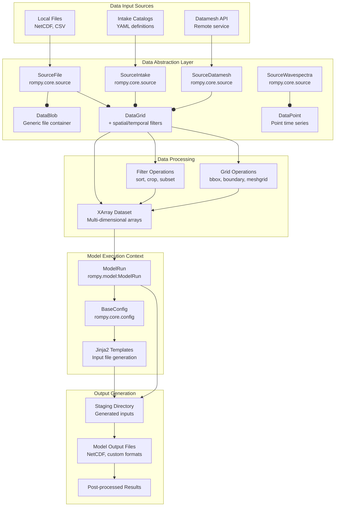

# Architecture Overview

This document provides a comprehensive overview of Rompy's architecture, explaining the advanced design patterns and component interactions. For basic concepts, please see the [Getting Started Guide](getting_started.md).

Rompy follows a modular, plugin-based architecture that separates concerns between configuration, execution, and post-processing:



## Advanced Architecture Patterns

### 1. Separation of Concerns
- Configuration (what to compute) is separate from execution (how to compute)
- Model setup is independent of execution environment
- Data sources are abstracted from model implementation

### 2. Composition over Inheritance
- Complex configurations built by composing simpler components
- Backends compose different capabilities rather than inheriting behavior

### 3. Type Safety with Pydantic
- Configuration objects validated at runtime
- Clear interfaces with type hints
- Automatic serialization/deserialization

### 4. Late Binding
- Execution backends resolved at runtime
- Enables the same configuration to run in different environments

---

## Core Components

The following diagram shows the core component architecture, highlighting the Pydantic foundation and how core abstractions and backend abstractions inherit from `RompyBaseModel`.



## Plugin Architecture

Rompy uses Python entry points for extensibility:

### Entry Points

1. **`rompy.config`**: Model configuration classes
2. **`rompy.run`**: Execution backends
3. **`rompy.postprocess`**: Post-processing modules
4. **`rompy.source`**: Data source implementations

### Extending Functionality

New components can be added through the plugin system:

```python
# Example: Adding a new model configuration
# Register in setup.py/pyproject.toml:
# [project.entry-points."rompy.config"]
# mymodel = "mypackage.config:MyModelConfig"

class MyModelConfig(BaseConfig):
    model_type: Literal["mymodel"] = "mymodel"
    # Custom model configuration attributes
```

## Data Flow Architecture

This flowchart illustrates the data processing pipeline, from input sources through abstraction, processing, and into the model execution context.



## Model Execution Pipeline

This sequence diagram details the three-stage execution lifecycle of `ModelRun`: Generate, Execution, and Post-processing.

```mermaid
sequenceDiagram
 participant User
 participant ModelRun["ModelRun<br/>rompy.model"]
 participant Config["BaseConfig"]
 participant TimeRange["TimeRange"]
 participant DataGrid["DataGrid"]
 participant Backend["Backend<br/>Local/Docker"]
 participant Model["Model Process"]
 participant Postprocessor
 
 User->>ModelRun: "Initialize(run_id, period, output_dir, config)"
 ModelRun->>TimeRange: "Validate and parse period"
 TimeRange-->>ModelRun: "start, end, interval"
 
 User->>ModelRun: "generate()"
 ModelRun->>Config: "Render configuration"
 Config->>DataGrid: "Fetch required data"
 DataGrid->>DataGrid: "Apply filters (crop, sort, buffer)"
 DataGrid-->>Config: "Filtered xarray.Dataset"
 Config->>Config: "Render Jinja2 templates"
 Config-->>ModelRun: "staging_dir with input files"
 
 User->>ModelRun: "run(backend=BackendConfig)"
 ModelRun->>Backend: "backend.get_backend_class()"
 Backend-->>ModelRun: "LocalRunBackend or DockerRunBackend"
 ModelRun->>Backend: "run(model_run, config, workspace_dir)"
 
 alt "Local Execution"
 Backend->>Model: "subprocess.run(command)"
 Model-->>Backend: "exit code"
 else "Docker Execution"
 Backend->>Backend: "_prepare_image (build or pull)"
 Backend->>Backend: "_get_run_command (with mpiexec if needed)"
 Backend->>Backend: "_prepare_volumes (mount staging_dir)"
 Backend->>Model: "docker.containers.run()"
 Model-->>Backend: "container exit code"
 end
 
 Backend-->>ModelRun: "success/failure boolean"
 
 opt "Post-processing"
 User->>ModelRun: "postprocess(processor='custom')"
 ModelRun->>Postprocessor: "process(model_run)"
 Postprocessor->>Postprocessor: "Validate outputs, create archives"
 Postprocessor-->>ModelRun: "results dict"
 ModelRun-->>User: "processed results"
 end
```

## Design Principles

### 1. Reproducibility
- Model configurations are fully serializable
- Same configuration produces identical results across environments
- Execution context tracked and logged

### 2. Extensibility
- Plugin system allows adding new models without changing core code
- Backend-agnostic design supports multiple execution environments
- Hook points available for custom processing

### 3. Environment Agnostic
- The same model configuration can run in multiple environments (local, HPC, cloud)
- Execution backends are resolved at runtime based on configuration

## Module Structure

### Core Modules
- `rompy.model`: Contains the main `ModelRun` class
- `rompy.core`: Basic abstractions (config, grid, data, source)
- `rompy.backends`: Backend implementations and configuration
- `rompy.run`: Run backend implementations
- `rompy.postprocess`: Post-processing implementations
- `rompy.pipeline`: Pipeline orchestration
- `rompy.logging`: Logging and formatting framework

### Key Classes and Their Responsibilities

| Class | Module | Responsibility |
|-------|--------|----------------|
| ModelRun | rompy.model | Main orchestrator for model runs |
| BaseConfig | rompy.core.config | Base configuration model |
| BaseGrid | rompy.core.grid | Base grid definition |
| DataGrid | rompy.core.data | Data grid abstraction |
| SourceBase | rompy.core.source | Base data source interface |
| LocalConfig | rompy.backends | Local backend configuration |
| DockerConfig | rompy.backends | Docker backend configuration |
| LocalRunBackend | rompy.run | Local execution backend |
| DockerRunBackend | rompy.run.docker | Docker execution backend |

## Integration Points

Rompy integrates with various external systems:

### Data Systems
- NetCDF files via xarray
- Intake catalogs for data discovery
- Various file formats through fsspec

### Execution Systems
- Docker for containerized execution
- HPC systems via job schedulers
- Cloud platforms for distributed computing

### Development Tools
- Pydantic for configuration validation
- Cookiecutter for template-based generation
- Standard Python logging

## Future Architecture Considerations

### Scalability
- Support for distributed model components
- Parallel execution of ensemble members
- Asynchronous job submission

### Extensibility
- Additional plugin interfaces for custom workflows
- Machine learning integration for parameter estimation
- Enhanced visualization capabilities

## Next Steps

- Review the [Plugin Architecture](plugin_architecture.md) for more details on extending Rompy
- Check the [Developer Guide](developer/index.md) for advanced development topics
- Look at the [API Reference](api.md) for detailed class documentation