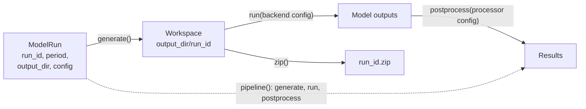
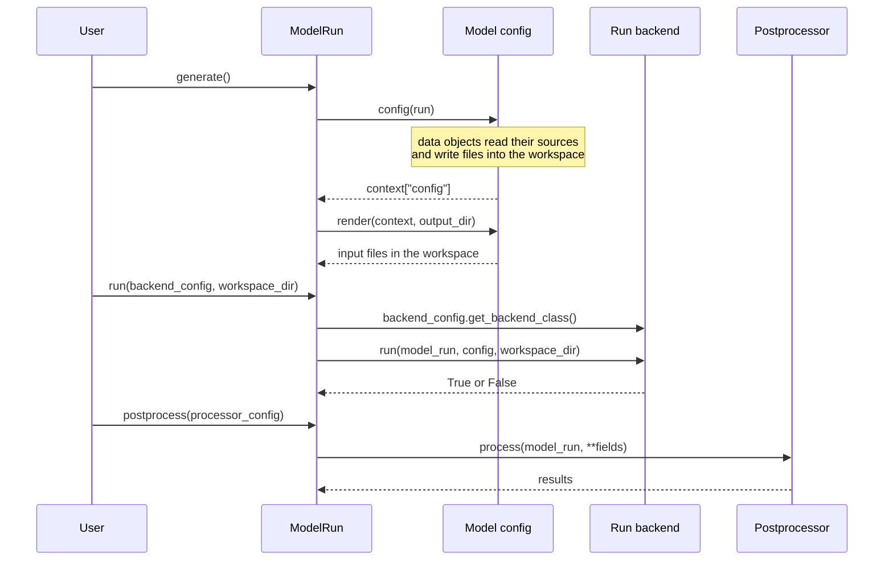

# The run lifecycle

rompy separates describing a model run from preparing it and from running it. A run is described by objects; generating writes the files the model reads; running adds an execution environment. Because the steps are separate, the same description can be inspected, generated on a laptop and run in Docker or on a cluster.

```python exec="on" session="lifecycle"
# Hidden setup: quiet logging and a temporary output folder.
import tempfile

from rompy.logging import config as logging_config

logging_config.update(level="WARNING")
OUT_DIR = tempfile.mkdtemp()
```

## The steps



| Step | Method | What it needs | What it does |
|---|---|---|---|
| Describe | [`ModelRun(...)`][rompy.model.ModelRun] | A model configuration, a period and an output directory | Validates the description. Nothing is written. |
| Generate | [`generate()`][rompy.model.ModelRun.generate] | Access to the input data | Fetches and processes the data and writes the model's input files into the workspace |
| Run | [`run(backend)`][rompy.model.ModelRun.run] | A backend configuration, and the model executable or image | Runs the model in the workspace |
| Postprocess | [`postprocess(processor)`][rompy.model.ModelRun.postprocess] | A postprocessor configuration | Checks, transforms or moves the outputs |
| All three | [`pipeline(...)`][rompy.model.ModelRun.pipeline] | A backend and a postprocessor configuration | Runs generate, run and postprocess in order |
| Archive | [`zip()`][rompy.model.ModelRun.zip] | A generated workspace | Zips the workspace and deletes the folder |

Only the run step needs a model executable. Generated files can be checked before anything runs: their presence shows that preparation worked, not that the scientific setup is right.

Inside the steps, `ModelRun` hands the work to the objects it holds:



The data objects, such as [`DataGrid`][rompy.core.data.DataGrid] or [`DataBlob`][rompy.core.data.DataBlob], belong to the model configuration. A `DataGrid` reads a source (a file, an intake catalogue, Datamesh) and writes the part the model needs; a `DataBlob` copies a file from a path or URI into the workspace.

## ModelRun

[`ModelRun`][rompy.model.ModelRun] holds what is common to every model:

| Field | Default | Meaning |
|---|---|---|
| `run_id` | `"run_id"` | Name of the run, and of its workspace folder |
| `period` | 2020-02-21 04:00 to 2020-02-24 04:00, 15 min | [`TimeRange`][rompy.core.time.TimeRange] of the simulation |
| `output_dir` | `./simulations` | Folder the workspace is created in |
| `config` | [`BaseConfig`][rompy.core.config.BaseConfig] | The model configuration, selected by its `model_type` |
| `delete_existing` | `False` | Delete an existing workspace before generating |
| `run_id_subdir` | `True` | Put the workspace in `output_dir/run_id`; if `False`, use `output_dir` itself |

`config` is a discriminated union of the configuration classes registered by the installed model plugins under the `rompy.config` entry point. `model_type: xbeach` selects rompy-xbeach's configuration, for example; see [How rompy-xbeach works](https://rom-py.github.io/rompy-xbeach/user-guide/how-it-works/) for what that configuration contains.

### The workspace

The workspace, or staging directory, is where the model's input files are written and where the model runs. It is `output_dir/run_id`, or `output_dir` when `run_id_subdir=False`. It is created the first time [`staging_dir`][rompy.model.ModelRun.staging_dir] is used, and emptied first if `delete_existing=True`. Otherwise existing files are kept and overwritten.

## Generate

This run uses rompy's base configuration, which renders a small example template:

```python exec="on" source="above" result="text" session="lifecycle"
from pathlib import Path

from rompy.core.config import BaseConfig
from rompy.core.time import TimeRange
from rompy.model import ModelRun

run = ModelRun(
    run_id="demo",
    period=TimeRange(start="2023-01-01", end="2023-01-02", interval="1h"),
    output_dir=OUT_DIR,
    config=BaseConfig(),
)
workspace = run.generate()

for path in sorted(workspace.rglob("*")):
    print(path.relative_to(OUT_DIR))
```

The `INPUT` file shows values taken from the run:

```python exec="on" source="above" result="text" session="lifecycle"
text = (workspace / "INPUT").read_text()
print("\n".join(line for line in text.splitlines() if not line.startswith("$")))
```

[`generate()`][rompy.model.ModelRun.generate] does three things:

1. **Builds the runtime context.** `context["runtime"]` is the run itself as a dictionary (`run.model_dump()`), plus `staging_dir`, generation metadata (`_generated_at`, `_generated_by`, `_generated_on`) and the date format `_datefmt`.
2. **Calls the configuration.** If the configuration is callable, `context["config"] = config(run)`; otherwise it is the configuration object. Model plugins do their data work here: a call reads the sources, writes forcing and grid files into the workspace and returns the values the templates need.
3. **Renders.** `config.render(context, run.output_dir)` writes the input files. The default renders a cookiecutter template; plugins can write files directly instead. See [Templates and rendering](templates.md).

It returns the workspace path.

## Run

[`run()`][rompy.model.ModelRun.run] takes a backend configuration: [`LocalConfig`][rompy.backends.config.LocalConfig], [`DockerConfig`][rompy.backends.config.DockerConfig] or [`SlurmConfig`][rompy.backends.config.SlurmConfig]. The configuration names the backend class that runs it, and `run()` returns `True` if the model succeeded.

A local command runs in the workspace. Here it is a shell command standing in for a model executable:

```python exec="on" source="above" result="text" session="lifecycle"
from rompy.backends import LocalConfig

ok = run.run(LocalConfig(command="echo 'model finished' > run.log"), workspace_dir=workspace)
print(ok, (workspace / "run.log").read_text())
```

Pass `workspace_dir` when the workspace is already generated. Without it, the backend calls `generate()` first. [Backends, postprocessors and pipelines](backends.md) describes the backends and their settings.

## Postprocess

[`postprocess()`][rompy.model.ModelRun.postprocess] takes a postprocessor configuration and returns a dictionary of results. The built-in no-op postprocessor only checks that the workspace exists:

```python exec="on" source="above" result="text" session="lifecycle"
from rompy.postprocess.config import NoopPostprocessorConfig

print(run.postprocess(NoopPostprocessorConfig()))
```

## Pipeline

[`pipeline()`][rompy.model.ModelRun.pipeline] runs the three steps with a pipeline backend, `"local"` by default. It stops at the first step that fails and reports which one:

```python exec="on" source="above" result="text" session="lifecycle"
results = run.pipeline(
    backend_config=LocalConfig(command="ls > files.txt"),
    processor=NoopPostprocessorConfig(),
)
print(results["success"], results["stages_completed"])
```

## Zip

[`zip()`][rompy.model.ModelRun.zip] writes the workspace to `<workspace>.zip` and then deletes the workspace folder:

```python exec="on" source="above" result="text" session="lifecycle"
archive = run.zip()
print(archive.name, workspace.exists())
```

## Variants and chained runs

Because a run is described by objects, a variant is a new run with one change: a different friction coefficient, wave boundary or period. Give each variant its own `run_id` so that each gets its own workspace; the inputs can then be compared before anything runs and the outputs afterwards. The same pattern covers sensitivity tests, calibration and ensembles.

```python exec="on" source="above" result="text" session="lifecycle"
for day in ["2023-01-01", "2023-01-02"]:
    variant = ModelRun(
        run_id=f"day-{day}",
        period=TimeRange(start=day, duration="1d", interval="1h"),
        output_dir=OUT_DIR,
        config=run.config,
    )
    print(variant.generate().name)
```

!!! warning "Copying a ModelRun"
    A `ModelRun` keeps its workspace path once it has been used. A copy made with `model_copy(update={"run_id": ...})` after `generate()` still points to the original workspace. Create variants as new `ModelRun` objects, as above.

Chained runs work the same way: the second run starts from the saved state of the first instead of from rest.

## See it in the notebooks

- XBeach: [generate and run a first model](https://rom-py.github.io/rompy-notebooks/notebooks/xbeach/tutorial/01_first_model/), [check a generated workspace](https://rom-py.github.io/rompy-notebooks/notebooks/xbeach/tutorial/06_complete_setup/), [run with a local installation, Docker or MPI](https://rom-py.github.io/rompy-notebooks/notebooks/xbeach/examples/running_xbeach/), [variants in a parameter sweep](https://rom-py.github.io/rompy-notebooks/notebooks/xbeach/examples/parameter_sweep/) and [chained runs](https://rom-py.github.io/rompy-notebooks/notebooks/xbeach/examples/hotstart_and_chained_runs/).
- SWAN: [a nonstationary hindcast](https://rom-py.github.io/rompy-notebooks/notebooks/swan/tutorial/06_nonstationary_hindcast/), [running with Docker and MPI](https://rom-py.github.io/rompy-notebooks/notebooks/swan/examples/running_swan/), [chained runs](https://rom-py.github.io/rompy-notebooks/notebooks/swan/examples/hotstart_and_chained_runs/) and [variants in a sensitivity study](https://rom-py.github.io/rompy-notebooks/notebooks/swan/examples/physics_sensitivity/).
- SCHISM: [execution and output verification](https://rom-py.github.io/rompy-notebooks/notebooks/schism/tutorial_07_schism_execution/).
